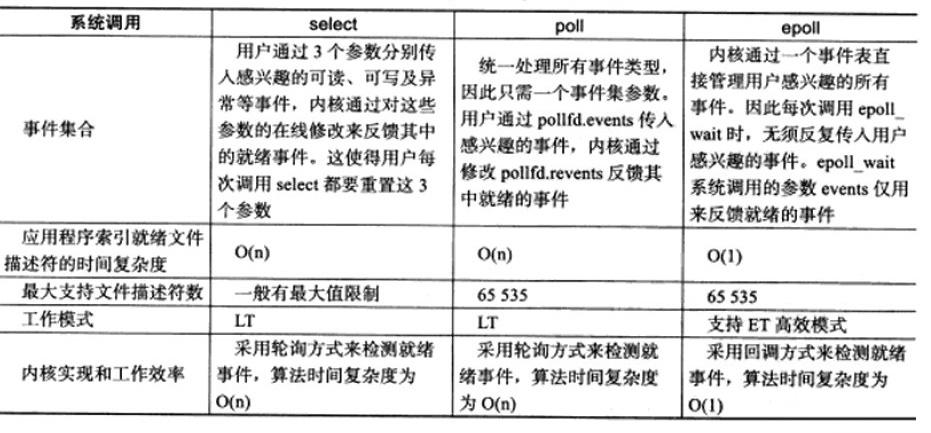

# i/o多路复用技术学习笔记

## 背景

为什么需要i/o多路复用技术？因为在网络编程中，原始的recv()等函数仅能监视单个文件描述符(socket)，为了线程能对多个文件描述符同时进行监视，便有了i/o多路复用技术.

## 类型

- select
- poll
- epoll

## select笔记

select监视多个socket的基本流程

```cpp
int s = socket(AF_INET, SOCK_STREAM, 0);  
bind(s, ...)
listen(s, ...)

int fds[] =  存放需要监听的socket

while(1){
    int n = select(..., fds, ...)
    for(int i=0; i < fds.count; i++){
        if(FD_ISSET(fds[i], ...)){
            //fds[i]的数据处理
        }
    }
}
```

select低效的两个重要原因:
- 最终需要遍历一遍才能知道哪几个socket活跃.
- 每次调用都要重新将进程添加到相应socket的等待队列里.

## poll笔记

与select类似，只是用 pollfd 数组替代位图，同时比select多了更多的事件监测.

## epoll笔记

epoll监视多个socket的基本流程

```cpp
int s = socket(AF_INET, SOCK_STREAM, 0);   
bind(s, ...)
listen(s, ...)

int epfd = epoll_create(...);
epoll_ctl(epfd, ...); //将所有需要监听的socket添加到epfd中

while(1){
    int n = epoll_wait(...)
    for(接收到数据的socket){
        //处理
    }
}
```

epoll的内核的监测socket的数据结构是红黑树，支持快速的增删改查；而epoll对象的就绪列表采用的是双向链表，链表上的每一个节点都是活跃的socket项，故查找就绪的socket时间复杂度仅为o(1)

## 对比



## 参考文章

知乎： https://zhuanlan.zhihu.com/p/64138532  
csdn： https://blog.csdn.net/s2603898260/article/details/106799129